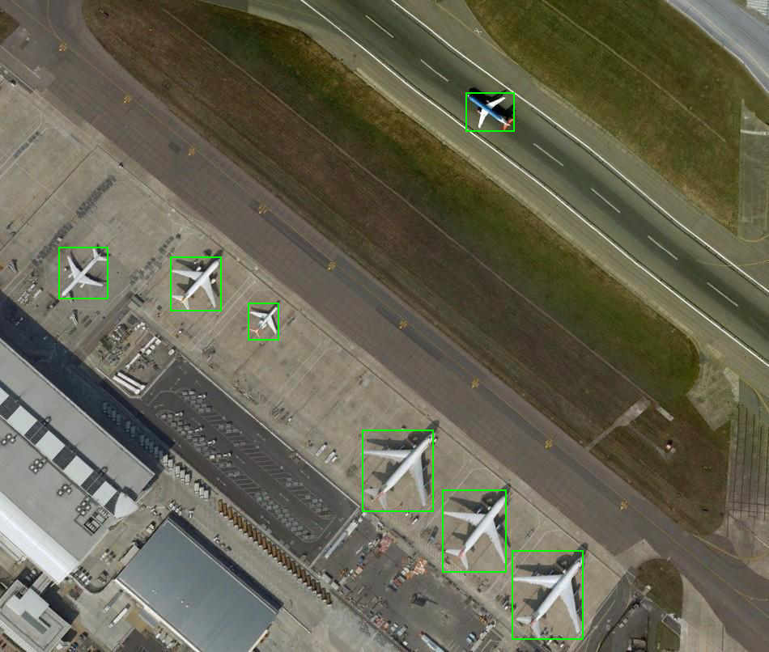
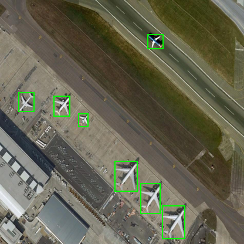
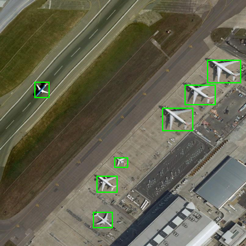
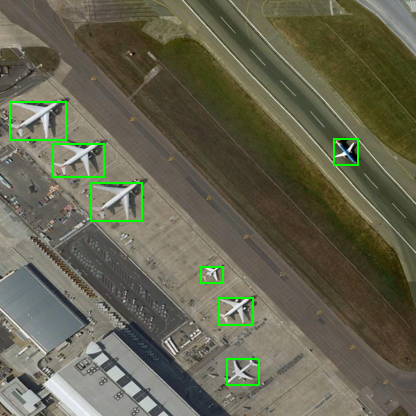
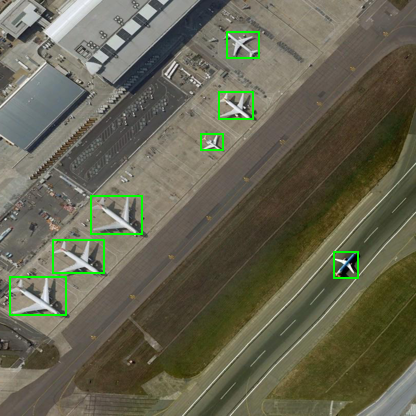

transform
==============
A simple augmentation for Object Detection

Look at [notebook](https://github.com/akanametov/transform/blob/main/notebook.ipynb) for more details!

### Install

```
pip install git+https://github.com/akanametov/transform.git#egg=transform
```

### Usage

```python
# import 
from transform import (Compose, Resize, Rotate, HorizontalFlip, VerticalFlip,
                       ToTensor, Normalize, PadBBox, DeNormalize, ToImage)
                       
# resize
resized_img, resized_bbox = Resize(size=...)(img, bbox)

# rotate
rotated_img, rotated_bbox = Rotate(p=...)(resized_img, resized_bbox)

# horizontally flip
hflipped_img, hflipped_bbox = HorizontalFlip(p=...)(rotated_img, rotated_bbox)

# vertically flip
vflipped_img, vflipped_bbox = VerticalFlip(p=...)(hflipped_img, hflipped_bbox)

# to torch tensor
torch_img, torch_bbox = ToTensor()(vflipped_img, vflipped_bbox)

# normalize
normalized_img, normalized_bbox = Normalize(mean=..., std=...)(torch_img, torch_bbox)

# pad bbox
normalized_img, padded_bbox = PadBBox(max_num_bbox=..., pad_value=...)(normalized_img, normalized_bbox)

# denormalize
denormalized_img, denormalized_bbox = DeNormalize(mean=..., std=...)(normalized_img, normalized_bbox)

# to pillow
pillow_img, list_bbox = ToImage()(denormalized_img, denormalized_bbox)

```
<a><div class='column'>
      
</div></a>

**Resize()**

<a><div class='column'>
      
</div></a>

**Rotate()**

<a><div class='column'>
      
</div></a>

**HorizontalFlip()**

<a><div class='column'>
      
</div></a>

**VerticalFlip()**

<a><div class='column'>
      
</div></a>


**ToTensor()**
```python
img_torch
```
```
tensor([[[0.5569, 0.5373, 0.4588,  ..., 0.3882, 0.3843, 0.3725],
         [0.5451, 0.4784, 0.3137,  ..., 0.3765, 0.3765, 0.3804],
         [0.4863, 0.5137, 0.4627,  ..., 0.3765, 0.3765, 0.3804],
         ...,
         [0.3922, 0.3922, 0.3922,  ..., 0.6549, 0.6863, 0.6431],
         [0.3961, 0.3961, 0.3961,  ..., 0.6392, 0.6510, 0.6314],
         [0.4000, 0.4000, 0.4000,  ..., 0.5412, 0.5529, 0.5647]],

        [[0.5294, 0.5098, 0.4314,  ..., 0.3529, 0.3490, 0.3373],
         [0.5098, 0.4392, 0.2745,  ..., 0.3412, 0.3412, 0.3451],
         [0.4314, 0.4588, 0.4039,  ..., 0.3412, 0.3412, 0.3451],
         ...,
         [0.3412, 0.3412, 0.3412,  ..., 0.6863, 0.7137, 0.6706],
         [0.3451, 0.3451, 0.3451,  ..., 0.6706, 0.6784, 0.6588],
         [0.3490, 0.3490, 0.3490,  ..., 0.5725, 0.5804, 0.5922]],

        [[0.4863, 0.4667, 0.3843,  ..., 0.3255, 0.3294, 0.3176],
         [0.4588, 0.3961, 0.2314,  ..., 0.3176, 0.3216, 0.3255],
         [0.3804, 0.4078, 0.3490,  ..., 0.3137, 0.3216, 0.3255],
         ...,
         [0.3059, 0.3059, 0.3059,  ..., 0.6588, 0.6863, 0.6431],
         [0.3098, 0.3098, 0.3098,  ..., 0.6431, 0.6510, 0.6314],
         [0.3137, 0.3137, 0.3137,  ..., 0.5451, 0.5529, 0.5647]]],
       dtype=torch.float64)
```
```python
bbox_torch
```
```
tensor([[333, 251, 358, 278,   1],
        [226,  31, 259,  58,   1],
        [218,  91, 253, 119,   1],
        [200, 133, 223, 150,   1],
        [ 90, 195, 142, 234,   1],
        [ 52, 239, 104, 273,   1],
        [  9, 276,  66, 315,   1]])
```
**Normalize()**
```python
img_norm
```
```
tensor([[[ 0.3138,  0.2282, -0.1143,  ..., -0.4226, -0.4397, -0.4911],
         [ 0.2624, -0.0287, -0.7479,  ..., -0.4739, -0.4739, -0.4568],
         [ 0.0056,  0.1254, -0.0972,  ..., -0.4739, -0.4739, -0.4568],
         ...,
         [-0.4054, -0.4054, -0.4054,  ...,  0.7419,  0.8789,  0.6906],
         [-0.3883, -0.3883, -0.3883,  ...,  0.6734,  0.7248,  0.6392],
         [-0.3712, -0.3712, -0.3712,  ...,  0.2453,  0.2967,  0.3481]],

        [[ 0.3277,  0.2402, -0.1099,  ..., -0.4601, -0.4776, -0.5301],
         [ 0.2402, -0.0749, -0.8102,  ..., -0.5126, -0.5126, -0.4951],
         [-0.1099,  0.0126, -0.2325,  ..., -0.5126, -0.5126, -0.4951],
         ...,
         [-0.5126, -0.5126, -0.5126,  ...,  1.0280,  1.1506,  0.9580],
         [-0.4951, -0.4951, -0.4951,  ...,  0.9580,  0.9930,  0.9055],
         [-0.4776, -0.4776, -0.4776,  ...,  0.5203,  0.5553,  0.6078]],

        [[ 0.3568,  0.2696, -0.0964,  ..., -0.3578, -0.3404, -0.3927],
         [ 0.2348, -0.0441, -0.7761,  ..., -0.3927, -0.3753, -0.3578],
         [-0.1138,  0.0082, -0.2532,  ..., -0.4101, -0.3753, -0.3578],
         ...,
         [-0.4450, -0.4450, -0.4450,  ...,  1.1237,  1.2457,  1.0539],
         [-0.4275, -0.4275, -0.4275,  ...,  1.0539,  1.0888,  1.0017],
         [-0.4101, -0.4101, -0.4101,  ...,  0.6182,  0.6531,  0.7054]]],
       dtype=torch.float64)
```
```python
box_norm
```
```
tensor([[0.8005, 0.6034, 0.8606, 0.6683, 1.0000],
        [0.5433, 0.0745, 0.6226, 0.1394, 1.0000],
        [0.5240, 0.2188, 0.6082, 0.2861, 1.0000],
        [0.4808, 0.3197, 0.5361, 0.3606, 1.0000],
        [0.2163, 0.4688, 0.3413, 0.5625, 1.0000],
        [0.1250, 0.5745, 0.2500, 0.6562, 1.0000],
        [0.0216, 0.6635, 0.1587, 0.7572, 1.0000]])
```
**PadBBox()**
```python
box_pad
```
```
tensor([[ 0.8005,  0.6034,  0.8606,  0.6683,  1.0000],
        [ 0.5433,  0.0745,  0.6226,  0.1394,  1.0000],
        [ 0.5240,  0.2188,  0.6082,  0.2861,  1.0000],
        [ 0.4808,  0.3197,  0.5361,  0.3606,  1.0000],
        [ 0.2163,  0.4688,  0.3413,  0.5625,  1.0000],
        [ 0.1250,  0.5745,  0.2500,  0.6562,  1.0000],
        [ 0.0216,  0.6635,  0.1587,  0.7572,  1.0000],
        [-1.0000, -1.0000, -1.0000, -1.0000, -1.0000],
        [-1.0000, -1.0000, -1.0000, -1.0000, -1.0000],
        [-1.0000, -1.0000, -1.0000, -1.0000, -1.0000]])
```
**DeNormalize()**
```python
img_denorm
```
```
tensor([[[0.5569, 0.5373, 0.4588,  ..., 0.3882, 0.3843, 0.3725],
         [0.5451, 0.4784, 0.3137,  ..., 0.3765, 0.3765, 0.3804],
         [0.4863, 0.5137, 0.4627,  ..., 0.3765, 0.3765, 0.3804],
         ...,
         [0.3922, 0.3922, 0.3922,  ..., 0.6549, 0.6863, 0.6431],
         [0.3961, 0.3961, 0.3961,  ..., 0.6392, 0.6510, 0.6314],
         [0.4000, 0.4000, 0.4000,  ..., 0.5412, 0.5529, 0.5647]],

        [[0.5294, 0.5098, 0.4314,  ..., 0.3529, 0.3490, 0.3373],
         [0.5098, 0.4392, 0.2745,  ..., 0.3412, 0.3412, 0.3451],
         [0.4314, 0.4588, 0.4039,  ..., 0.3412, 0.3412, 0.3451],
         ...,
         [0.3412, 0.3412, 0.3412,  ..., 0.6863, 0.7137, 0.6706],
         [0.3451, 0.3451, 0.3451,  ..., 0.6706, 0.6784, 0.6588],
         [0.3490, 0.3490, 0.3490,  ..., 0.5725, 0.5804, 0.5922]],

        [[0.4863, 0.4667, 0.3843,  ..., 0.3255, 0.3294, 0.3176],
         [0.4588, 0.3961, 0.2314,  ..., 0.3176, 0.3216, 0.3255],
         [0.3804, 0.4078, 0.3490,  ..., 0.3137, 0.3216, 0.3255],
         ...,
         [0.3059, 0.3059, 0.3059,  ..., 0.6588, 0.6863, 0.6431],
         [0.3098, 0.3098, 0.3098,  ..., 0.6431, 0.6510, 0.6314],
         [0.3137, 0.3137, 0.3137,  ..., 0.5451, 0.5529, 0.5647]]],
       dtype=torch.float64)
```
```python
box_denorm
```
```
tensor([[333, 251, 358, 278,   1],
        [226,  31, 259,  58,   1],
        [218,  91, 253, 119,   1],
        [200, 133, 223, 150,   1],
        [ 90, 195, 142, 234,   1],
        [ 52, 239, 104, 273,   1],
        [  9, 276,  66, 315,   1]])
```
**ToImage()**

<a><div class='column'>
      
</div></a>


### License

This project is licensed under MIT License
